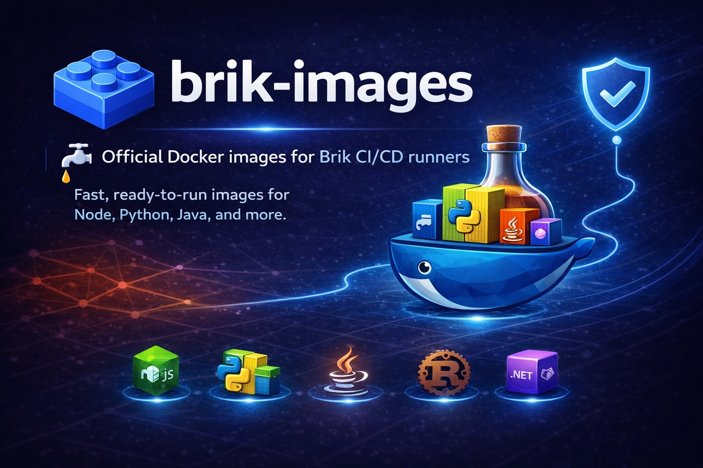

<p align="center">
  
</p>

<p align="center">
  <b>Brik, the portable pipeline standard.</b><br>
  <b>Write once. Run everywhere.</b>
</p>

[](https://github.com/getbrik/brik-images/actions/workflows/build.yml)

Official Docker images for [Brik](https://github.com/getbrik/brik) CI/CD runners.

Pre-built images with all Brik prerequisites (bash 5+, yq, jq, git) and stack-specific tools. Eliminates the ~30-40s bootstrap overhead from every CI job.

## Available Images

| Image | Version | Security | Pull command |
|-------|---------|----------|--------------|
| `brik-runner-base` | `3.23` |  | `docker pull ghcr.io/getbrik/brik-runner-base` |
| `brik-runner-node` | `22` |  | `docker pull ghcr.io/getbrik/brik-runner-node:22` |
| `brik-runner-node` | `24` |  | `docker pull ghcr.io/getbrik/brik-runner-node:24` |
| `brik-runner-python` | `3.13` |  | `docker pull ghcr.io/getbrik/brik-runner-python:3.13` |
| `brik-runner-python` | `3.14` |  | `docker pull ghcr.io/getbrik/brik-runner-python:3.14` |
| `brik-runner-java` | `21` |  | `docker pull ghcr.io/getbrik/brik-runner-java:21` |
| `brik-runner-java` | `25` |  | `docker pull ghcr.io/getbrik/brik-runner-java:25` |
| `brik-runner-rust` | `1` |  | `docker pull ghcr.io/getbrik/brik-runner-rust:1` |
| `brik-runner-dotnet` | `9.0` |  | `docker pull ghcr.io/getbrik/brik-runner-dotnet:9.0` |
| `brik-runner-dotnet` | `10.0` |  | `docker pull ghcr.io/getbrik/brik-runner-dotnet:10.0` |
| `brik-runner-quality-lite` | `1` |  | `docker pull ghcr.io/getbrik/brik-runner-quality-lite` |
| `brik-runner-quality` | `1` |  | `docker pull ghcr.io/getbrik/brik-runner-quality` |
| `brik-runner-security` | `1` |  | `docker pull ghcr.io/getbrik/brik-runner-security` |

All images are multi-arch: `linux/amd64` and `linux/arm64`.

## Security

- Images are scanned with [Grype](https://github.com/anchore/grype) on every build (blocks on **critical** CVEs with available fixes)
- Scan results are uploaded to the [Security tab](https://github.com/getbrik/brik-images/security/code-scanning) for full visibility
- SBOMs are generated with [Syft](https://github.com/anchore/syft) in CycloneDX format
- Images are signed with [cosign](https://github.com/sigstore/cosign) (keyless, OIDC)
- Weekly rebuilds pick up base image security patches
- [Renovate](https://github.com/renovatebot/renovate) auto-merges digest updates

### Security policy

These images bundle the latest available versions of their respective base images and tools (yq, jq, git). Some upstream base images (e.g. `node:22-slim`, `python:3.13-slim`) may contain known vulnerabilities that have not yet been patched by their maintainers.

**What we control:** yq, jq, and git versions are pinned to the latest releases and updated regularly. The build fails on any **critical** CVE with an available fix.

**What we don't control:** CVEs in the upstream base images (Alpine, Debian, Ubuntu). These are resolved when the upstream maintainers publish updated images. Weekly rebuilds automatically pick up new patches.

Check the [Security tab](https://github.com/getbrik/brik-images/security/code-scanning) for the current scan results of every image.

## Tag Convention

Each image is published with multiple tags:

```
ghcr.io/getbrik/brik-runner-node:22              # stack version (mutable)
ghcr.io/getbrik/brik-runner-node:latest           # latest LTS (mutable)
ghcr.io/getbrik/brik-runner-node:sha-a1b2c3d      # immutable git SHA
ghcr.io/getbrik/brik-runner-node:22@sha256:...    # digest pin (most secure)
```

**For production pipelines**, pin images by digest (`@sha256:...`) to guarantee reproducible builds. Mutable tags like `:22` or `:latest` can change on rebuilds. Use `docker inspect --format='{{index .RepoDigests 0}}' <image>` to retrieve the current digest.

## What's Included

Every image contains:

- **bash** (5.x)
- **yq** (v4.52.5) - YAML processor
- **jq** (1.8.1) - JSON processor
- **git** - version control
- **curl** - HTTP client

Stack images additionally include their respective toolchain (node/npm, python/pip, java/maven, etc.).

### Quality Lite vs Quality

The quality tooling is split into two images to optimize pull times:

- **quality-lite** -- fast to pull, static Go binaries only, ideal for vulnerability scanning and Dockerfile linting in every pipeline
- **quality** -- heavier, includes Python/Ruby runtimes, for deep SAST analysis, license compliance, and IaC scanning

Use `quality-lite` when you only need SCA/SBOM/linting. Use `quality` when you need semgrep, checkov, scancode, or license_finder.

### Quality Lite Image

The `brik-runner-quality-lite` image (~450 MB) bundles lightweight static binary tools -- no Python or Ruby runtime:

| Tool | Purpose |
|------|---------|
| grype | Vulnerability scanning (SCA) |
| syft | SBOM generation |
| osv-scanner | Open-source vulnerability scanning |
| hadolint | Dockerfile linting |

### Quality Image

The `brik-runner-quality` image (~1.7 GB) bundles Python/Ruby-based analysis tools via multi-stage build (down from ~3 GB):

| Tool | Purpose |
|------|---------|
| semgrep | Static analysis (SAST) |
| checkov | Infrastructure-as-Code scanning |
| scancode-toolkit | License and origin detection |
| license_finder | License compliance |

### Security Image

The `brik-runner-security` image bundles secret detection and container security tools:

| Tool | Purpose |
|------|---------|
| gitleaks | Secret/credential leak detection |
| trufflehog | Secret scanning (entropy + patterns) |
| dockle | Docker image best-practice linting |
| grype | Vulnerability scanning (SCA) |
| syft | SBOM generation |
| osv-scanner | Open-source vulnerability scanning |

Pinned versions for all tools are in [`versions.json`](versions.json).

**Note:** The brik runtime is NOT pre-installed. It is cloned at CI time by the shared library's `before_script`. This decouples image releases from brik releases.

## Roadmap: Brik Runtime in Images

Currently, the brik runtime is cloned at CI time by the shared library's `before_script`. This keeps image releases decoupled from brik development, which is the right trade-off during active development.

Once brik reaches a stable release cadence, the runtime will be pre-installed in the images. This will unlock:

- **Zero-config local usage** -- `docker run ghcr.io/getbrik/brik-runner-node:22 brik run stage build` with no setup, no clone, no CI platform required.
- **Fully offline pipelines** -- images become self-contained, no network dependency at runtime.
- **Freemium / Enterprise tiers** -- community images ship with brik core; enterprise images could include additional modules, caching layers, or premium integrations.

## Usage

### GitLab CI

```yaml
# .gitlab-ci.yml
variables:
  # Pin by digest for reproducible builds: ghcr.io/getbrik/brik-runner-node:22@sha256:...
  BRIK_CI_IMAGE: "ghcr.io/getbrik/brik-runner-node:22"

include:
  - project: 'brik/gitlab-templates'
    ref: v1
    file: '/templates/pipeline.yml'
```

Or override per-job:

```yaml
build:
  image: ghcr.io/getbrik/brik-runner-node:22  # or :22@sha256:... for digest pin
  script:
    - brik run stage build
```

### Jenkins

```groovy
pipeline {
    agent {
        docker {
            // Pin by digest for reproducible builds:
            // image 'ghcr.io/getbrik/brik-runner-java:21@sha256:...'
            image 'ghcr.io/getbrik/brik-runner-java:21'
        }
    }
    stages {
        stage('Build') {
            steps {
                sh 'brik run stage build'
            }
        }
    }
}
```

### GitHub Actions

```yaml
jobs:
  build:
    runs-on: ubuntu-latest
    container:
      # Pin by digest for reproducible builds:
      # image: ghcr.io/getbrik/brik-runner-node:22@sha256:...
      image: ghcr.io/getbrik/brik-runner-node:22
    steps:
      - uses: actions/checkout@v4
      - run: brik run stage build
```

### Local Development

```bash
docker run --rm -v "$(pwd):/workspace" -w /workspace \
  ghcr.io/getbrik/brik-runner-node:22 \
  brik run stage build
```

## Building Locally

### Quick Start

```bash
# Build all images (multi-arch, no push)
./scripts/build-local.sh

# Build and load into local Docker (native arch only)
./scripts/build-local.sh --load

# Build specific stacks (expands to all versions)
./scripts/build-local.sh --load node python

# Build specific targets
./scripts/build-local.sh --load quality-lite-1 quality-1 security-1
```

### build-local.sh Options

| Option | Description |
|--------|-------------|
| (no args) | Build all images (multi-arch) |
| `<stack>` | Build all versions of a stack (e.g. `node` builds `node-22` + `node-24`) |
| `<target>` | Build a specific target (e.g. `node-22`, `quality-1`) |
| `--load` | Load images into local Docker (forces native arch) |
| `--platform PLAT` | Override platforms (e.g. `linux/amd64`) |
| `--no-cache` | Disable Docker build cache |
| `--regenerate` | Regenerate `docker-bake.hcl` before building |
| `--push` | Push images to registry (requires authentication) |
| `--list` | List all available targets and stacks |
| `--dry-run` | Show the command without executing it |

### Examples

```bash
# List available targets
./scripts/build-local.sh --list

# Rebuild quality image from scratch, single arch
./scripts/build-local.sh --load --no-cache quality-1

# Build for a specific platform
./scripts/build-local.sh --platform linux/amd64 security-1

# Regenerate bake file and build everything
./scripts/build-local.sh --regenerate --load

# Preview the command without running it
./scripts/build-local.sh --dry-run node java
```

### Other Scripts

```bash
# Generate the bake file from the version matrix
./scripts/generate-bake.sh

# Run smoke tests on built images
./scripts/smoke-test.sh

# Lint Dockerfiles
hadolint images/*/Dockerfile
```

## Version Matrix

All tool and stack versions are defined in `versions.json` (single source of truth). To add or update a version:

1. Edit `versions.json`
2. Run `./scripts/generate-bake.sh` (or use `--regenerate` with `build-local.sh`)
3. Commit and push -- CI handles the rest

## License

MIT
