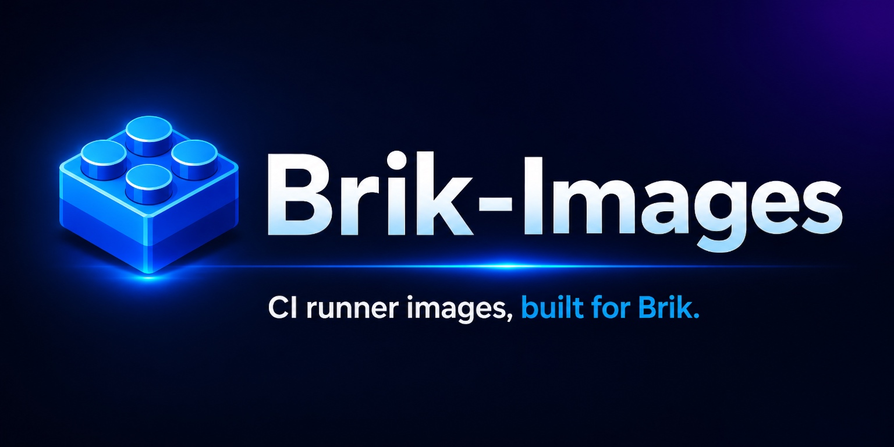

<p align="center">
  
</p>

<p align="center">
  <b>CI runner images, built for Brik.</b><br>
  Pre-installed bash + yq + jq + git + your stack toolchain. Signed, attested, scanned, multi-arch.<br>
  <i>Stop bootstrapping every CI job.</i>
</p>

[](https://github.com/getbrik/brik-images/actions/workflows/build.yml)
[](https://github.com/getbrik/brik-images/attestations)
[](#verifying)

Official Docker images for [Brik](https://github.com/getbrik/brik) CI/CD runners.

## The problem these images solve

Stock language images (`node:24-slim`, `python:3.13-slim`) are great for development. They are not built for CI:

- Every CI job re-installs the same `bash 5+`, `yq`, `jq`, `git`, `curl`. 30 to 40 seconds, every job, every pipeline.
- No signature, no attestation, no SBOM. You take the maintainer's word for what is inside.
- CVE patches lag. Stock images rebuild on the maintainer's cadence, not yours.
- No CI-specific tooling. SAST, SCA, secret scanning, container linting: you bring your own and install per job.

brik-images are CI runner images. Bootstrap is gone. Provenance is signed. CVE posture is published live, per image, on every push. Scanner and analysis tools come pre-installed in dedicated images.

## What makes these images different

### 🔐 Signed and attested

Every image is signed with [cosign](https://github.com/sigstore/cosign) (keyless, OIDC) and carries a SLSA build-provenance attestation you can verify with `gh attestation verify`. No supply chain trust gap. See [Verifying](#verifying) for the exact commands.

### 🔍 Honestly scanned

Live CVE counts in the [Available images](#available-images) table, not a static "0 vulnerabilities" badge. The build hard-fails **only** on a Critical CVE that has an available upstream fix. Everything else is recorded, visible in the [Security tab](https://github.com/getbrik/brik-images/security/code-scanning), and treated as known posture rather than hidden risk. The full posture is documented in [Current CVE posture](#current-cve-posture).

### 🔄 Continuously rebuilt

Every build applies the base image's pending OS security updates (`apt-get upgrade`). Weekly rebuilds refresh base images. [Dependabot](https://github.com/dependabot/dependabot-core) auto-merges digest updates. Suppressed CVEs are reviewed every Monday by an automated [CVE Suppression Review issue](https://github.com/getbrik/brik-images/issues?q=is%3Aissue+label%3Acve-suppression-review) so nothing rots silently.

### 🧱 Built for Brik

`bash 5+`, `yq`, `jq`, `git`, `curl` are pre-installed in every image. Stack images add their toolchain. The Brik runtime itself is cloned at CI time by the shared library's `before_script`, which decouples image releases from Brik releases.

## What's included

Every image contains:

- **bash** (5.x)
- **yq**: YAML processor
- **jq**: JSON processor
- **git**: version control
- **curl**: HTTP client

Stack images additionally include their respective toolchain (node/npm, python/pip, java/maven, rust/cargo, dotnet/sdk). Exact pinned versions of every bundled tool are in [`versions.json`](versions.json).

### Analysis vs scanner

The scanning tooling is split into two images based on their runtime requirements:

- **analysis**: Python/Ruby runtime, for deep SAST analysis, license compliance, and IaC scanning.
- **scanner**: static Go binaries only, fast to pull, for vulnerability scanning, secret detection, Dockerfile linting, and container scanning.

#### Analysis image (~1.7 GB)

| Tool | Purpose |
|------|---------|
| semgrep | Static analysis (SAST) |
| checkov | Infrastructure-as-Code scanning |
| scancode-toolkit | License and origin detection |
| license_finder | License compliance |

#### Scanner image (~500 MB)

| Tool | Purpose |
|------|---------|
| grype | Vulnerability scanning (SCA) |
| syft | SBOM generation |
| osv-scanner | Open-source vulnerability scanning |
| hadolint | Dockerfile linting |
| gitleaks | Secret/credential leak detection |
| trufflehog | Secret scanning (entropy + patterns) |
| dockle | Docker image best-practice linting |

> [!NOTE]
> The Brik runtime itself is NOT pre-installed. It is cloned at CI time by the shared library's `before_script`. This decouples image releases from Brik releases.

### Deploy image

`brik-runner-deploy` (FROM base) carries the CD toolchain used by the deploy-class runner in Brik's CD flow. It adds cosign and oras on top of the deploy tools so the flow can verify the signed attestation on the resolved digest before deploying.

| Tool | Purpose |
|------|---------|
| helm | Kubernetes package manager |
| kubectl | Kubernetes CLI |
| argocd | GitOps CD controller CLI |
| cosign | Verify image signatures and attestations |
| oras | OCI artifact transport (evidence) |

## Available images

| Image | Version | Security | Pull command |
|-------|---------|----------|--------------|
| `brik-runner-base` | `3.24` |  | `docker pull ghcr.io/getbrik/brik-runner-base` |
| `brik-runner-node` | `22` |  | `docker pull ghcr.io/getbrik/brik-runner-node:22` |
| `brik-runner-node` | `24` |  | `docker pull ghcr.io/getbrik/brik-runner-node:24` |
| `brik-runner-python` | `3.13` |  | `docker pull ghcr.io/getbrik/brik-runner-python:3.13` |
| `brik-runner-python` | `3.14` |  | `docker pull ghcr.io/getbrik/brik-runner-python:3.14` |
| `brik-runner-java` | `21` |  | `docker pull ghcr.io/getbrik/brik-runner-java:21` |
| `brik-runner-java` | `25` |  | `docker pull ghcr.io/getbrik/brik-runner-java:25` |
| `brik-runner-rust` | `1` |  | `docker pull ghcr.io/getbrik/brik-runner-rust:1` |
| `brik-runner-dotnet` | `9.0` |  | `docker pull ghcr.io/getbrik/brik-runner-dotnet:9.0` |
| `brik-runner-dotnet` | `10.0` |  | `docker pull ghcr.io/getbrik/brik-runner-dotnet:10.0` |
| `brik-runner-analysis` | `1` |  | `docker pull ghcr.io/getbrik/brik-runner-analysis` |
| `brik-runner-scanner` | `1` |  | `docker pull ghcr.io/getbrik/brik-runner-scanner` |
| `brik-runner-deploy` | `1` |  | `docker pull ghcr.io/getbrik/brik-runner-deploy` |

All images are multi-arch: `linux/amd64` and `linux/arm64`.

## Security

Every image is scanned, signed, and continuously rebuilt:

- ✅ Scanned with [Grype](https://github.com/anchore/grype) on every build. The build **hard-fails only on a Critical CVE that has an available upstream fix**. Critical and High CVEs that upstream has not patched yet are recorded, not blocked.
- ✅ Scan results uploaded to the [Security tab](https://github.com/getbrik/brik-images/security/code-scanning) for full per-image visibility.
- ✅ SBOMs generated with [Syft](https://github.com/anchore/syft) in CycloneDX format.
- ✅ Images signed with [cosign](https://github.com/sigstore/cosign) (keyless, OIDC).
- ✅ Every build applies the base image's pending OS security updates; weekly rebuilds refresh the base images; [Dependabot](https://github.com/dependabot/dependabot-core) auto-merges digest updates.

### Current CVE posture

> [!IMPORTANT]
> **These images are not CVE-free.** They bundle the latest upstream base images (`node:*-slim`, `python:*-slim`, Debian, Alpine), and those carry vulnerabilities their maintainers have not patched yet. Several stack images currently show **Critical** CVEs, and every non-base image shows dozens of **High**. The per-image badge in the [Available images](#available-images) table is the live count, and the [Security tab](https://github.com/getbrik/brik-images/security/code-scanning) the per-CVE detail. Treat those, not this prose, as the source of truth.

**What we control:** the bundled tools (`yq`, `jq`, `git`, and the scanner/analysis binaries) are pinned to current releases and bumped regularly; the build blocks on a Critical that has a fix.

**What we don't control:** CVEs in the language runtimes themselves and in statically-linked Go binaries; those clear only when the runtime or tool upstream ships a patched release. For production use, pin images by digest and run a scan gate against your own risk policy.

### Suppressed CVEs

> [!IMPORTANT]
> A few CVEs are suppressed in [`.grype.yaml`](.grype.yaml) so the build can stay green: Go-toolchain vulnerabilities compiled into statically-linked scanner binaries (`dockle`, `gitleaks`, `osv-scanner`) that we cannot remediate without forking the upstream project. [`.grype.yaml`](.grype.yaml) is the canonical list.

The **live status** (the per-tool breakdown, and whether a patched upstream release is available yet) is the auto-refreshed [CVE Suppression Review issue](https://github.com/getbrik/brik-images/issues?q=is%3Aissue+label%3Acve-suppression-review), regenerated every Monday by [`scripts/review-cve-suppressions.sh`](scripts/review-cve-suppressions.sh). When a tool ships a release on a patched Go, bump it in [`versions.json`](versions.json) and drop its entry from `.grype.yaml` and [`.cve-suppressions.json`](.cve-suppressions.json).

### Verifying

Every image is signed with cosign (keyless) and carries a SLSA build-provenance attestation. To verify a pulled image yourself (adjust the tag as needed):

```bash
# cosign signature
cosign verify ghcr.io/getbrik/brik-runner-node:24 \
  --certificate-identity-regexp 'https://github.com/getbrik/brik-images/.*' \
  --certificate-oidc-issuer https://token.actions.githubusercontent.com

# GitHub build-provenance attestation
gh attestation verify oci://ghcr.io/getbrik/brik-runner-node:24 --owner getbrik
```

Every attestation is also listed on the [Attestations page](https://github.com/getbrik/brik-images/attestations).

## Tag convention

Each image is published with multiple tags:

```
ghcr.io/getbrik/brik-runner-node:22              # stack version (mutable)
ghcr.io/getbrik/brik-runner-node:latest           # latest LTS (mutable)
ghcr.io/getbrik/brik-runner-node:sha-a1b2c3d      # immutable git SHA
ghcr.io/getbrik/brik-runner-node:22@sha256:...    # digest pin (most secure)
```

> [!IMPORTANT]
> **For production pipelines**, pin images by digest (`@sha256:...`) to guarantee reproducible builds. Mutable tags like `:22` or `:latest` can change on rebuilds. Use `docker inspect --format='{{index .RepoDigests 0}}' <image>` to retrieve the current digest.

## Usage

You do not pick the image by hand, and you do not install `brik` into it. The `init` job
reads `project.stack` and `project.stack_version` from your `brik.yml` and resolves each
stage to the matching `ghcr.io/getbrik/brik-runner-<stack>:<version>`; the shared library
clones the Brik runtime into the container at job start.

### GitLab CI

Include the Brik template. That is the whole pipeline:

```yaml
# .gitlab-ci.yml
include:
  - project: 'brik/gitlab-templates'
    ref: v0.7.0
    file: '/templates/brik-integrate.yml'
```

With `project.stack: node` and `stack_version: "22"` in `brik.yml`, the stage jobs run on
`ghcr.io/getbrik/brik-runner-node:22`; the scan, analysis and deploy stages run on their
dedicated images automatically.

### Jenkins

Load the Brik shared library and call the orchestrator. Same automatic image resolution
from `brik.yml`:

```groovy
// Jenkinsfile
@Library('brik') _
brikIntegrate()
```

### Local

With the Brik CLI installed on your host, run the flow straight from your project directory. Brik drives the same containerized engine as CI, spawning one brik-runner container per stage (the image is resolved from your `brik.yml`):

```bash
brik integrate      # full CI flow locally, one container per stage
brik stage build    # or run a single stage in its runner image
```

### Using your own images (mirror, private registry, custom runners)

Each runner class maps to an image in a runner-class map. To pull from a mirror, an
air-gapped registry, or your own runners extended with in-house tooling, point Brik at an
alternate map with the `BRIK_RUNNER_CLASSES_FILE` pipeline variable (a CI variable on
GitLab, a build parameter on Jenkins) instead of editing your CI file:

```yaml
# my-runner-classes.yml, committed in your repo
classes:
  base:     { image: registry.example.com/acme/brik-runner-base,     tag: "1.4.0" }
  scanner:  { image: registry.example.com/acme/brik-runner-scanner,  tag: "1.4.0" }
  analysis: { image: registry.example.com/acme/brik-runner-analysis, tag: "1.4.0" }
  deploy:   { image: registry.example.com/acme/brik-runner-deploy,   tag: "1.4.0" }
  stack:    { image_env: BRIK_CI_IMAGE }   # stack image stays resolved from brik.yml
```

Then set `BRIK_RUNNER_CLASSES_FILE=my-runner-classes.yml` for the pipeline.

> [!NOTE]
> Native pipeline templates exist for GitLab and Jenkins. The same containerized engine also runs on any host with Docker, including a CI runner with no native Brik adapter such as GitHub Actions: install the CLI and call `brik integrate`. The only thing still on the [Roadmap](#roadmap) is the zero-config form, `docker run <brik-runner-image> brik ...`, with Brik baked into the image so no host install is needed.

## Building locally

### Quick start

```bash
# Build all images (multi-arch, no push)
./scripts/build-local.sh

# Build and load into local Docker (native arch only)
./scripts/build-local.sh --load

# Build specific stacks (expands to all versions)
./scripts/build-local.sh --load node python

# Build specific targets
./scripts/build-local.sh --load analysis-1 scanner-1
```

### build-local.sh options

| Option | Description |
|--------|-------------|
| (no args) | Build all images (multi-arch) |
| `<stack>` | Build all versions of a stack (e.g. `node` builds `node-22` + `node-24`) |
| `<target>` | Build a specific target (e.g. `node-22`, `quality-1`) |
| `--load` | Load images into local Docker (forces native arch) |
| `--platform PLAT` | Override platforms (e.g. `linux/amd64`) |
| `--no-cache` | Disable Docker build cache |
| `--regenerate` | Regenerate `docker-bake.hcl` before building |
| `--push` | Push images to registry (requires authentication) |
| `--list` | List all available targets and stacks |
| `--dry-run` | Show the command without executing it |

### Examples

```bash
# List available targets
./scripts/build-local.sh --list

# Rebuild analysis image from scratch, single arch
./scripts/build-local.sh --load --no-cache analysis-1

# Build for a specific platform
./scripts/build-local.sh --platform linux/amd64 scanner-1

# Regenerate bake file and build everything
./scripts/build-local.sh --regenerate --load

# Preview the command without running it
./scripts/build-local.sh --dry-run node java
```

### Other scripts

```bash
# Generate the bake file from the version matrix
./scripts/generate-bake.sh

# Run smoke tests on built images
./scripts/smoke-test.sh

# Lint Dockerfiles
hadolint images/*/Dockerfile
```

## Version matrix

All tool and stack versions are defined in `versions.json` (single source of truth). To add or update a version:

1. Edit `versions.json`
2. Run `./scripts/generate-bake.sh` (or use `--regenerate` with `build-local.sh`)
3. Commit and push; CI handles the rest

## Roadmap

The Brik runtime is currently cloned at run time (by the GitLab and Jenkins adapters, and by the local engine) rather than baked into the image, keeping image releases decoupled from Brik development. So today you run Brik with the CLI installed on your host (see [Local](#local)). Once Brik reaches a stable release cadence, the runtime will be pre-installed in the images, unlocking zero-config use with no host install (`docker run ghcr.io/getbrik/brik-runner-node:22 brik stage build`) and fully offline pipelines.

## License

MIT
